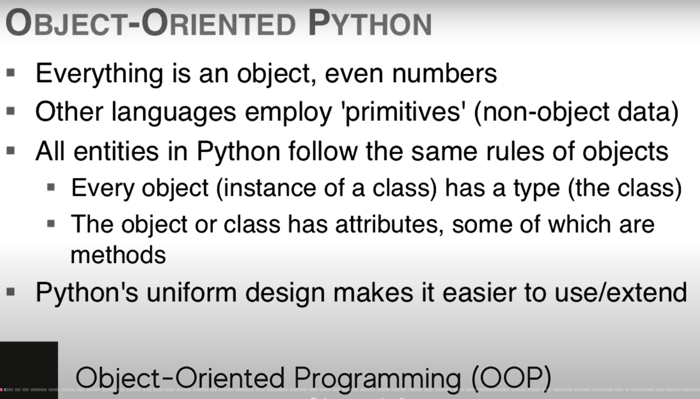

## Notas do curso: Python Object Oriented Programming - Full Course For Beginners (youtube)

- tudo em python é um objeto, incluindo dados primitivos. Toda entidade em python é um objeto.

What is an Ibject?
An object is a unit of data (having one or more attributes), of a particular class or type, with associated functionality(methods).

