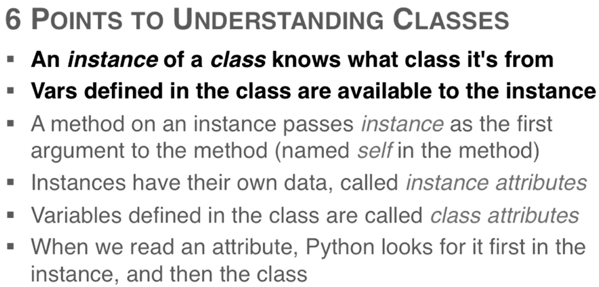
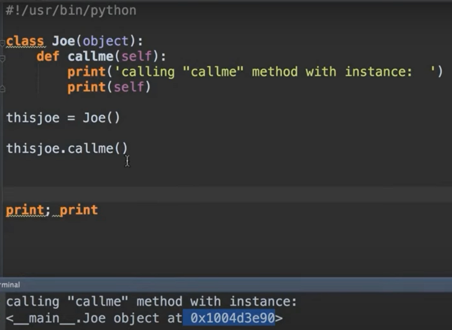
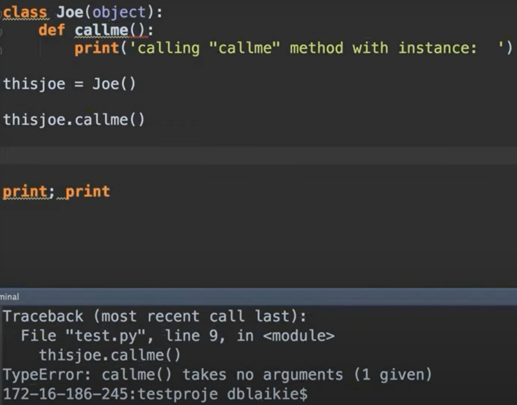

## Notas do curso: Python Object Oriented Programming - Full Course For Beginners (youtube)

- tudo em python é um objeto, incluindo dados primitivos. Toda entidade em python é um objeto.

What is an Ibject?
An object is a unit of data (having one or more attributes), of a particular class or type, with associated functionality(methods).

- All classes begin with capital letter

## Self

quando um método de uma instanica é chamado, a própria instancia é passada como primeiro argumento do método.

Por isso que quando um método de uma classe é definido, usa-se a palavra 'self' como argumento obrigatório desse método.

É uma característica do python e está implícito na chamada do método.

Caso o método da classe seja definido sem o argumento 'self', ao chamar esse método o seguinte erro é retornado:

'o método chamado não exige argumentos mas 1 (argumento) foi passado'

Ou seja, em python, quando um método de uma instanica é chamado, a própria instância será passada como argumento para esse método e caso em sua definiçaõ não tiver sido indicado que a própria instancia é um argumento (omitindo o 'self') o erro da figura acima é gerado. 

